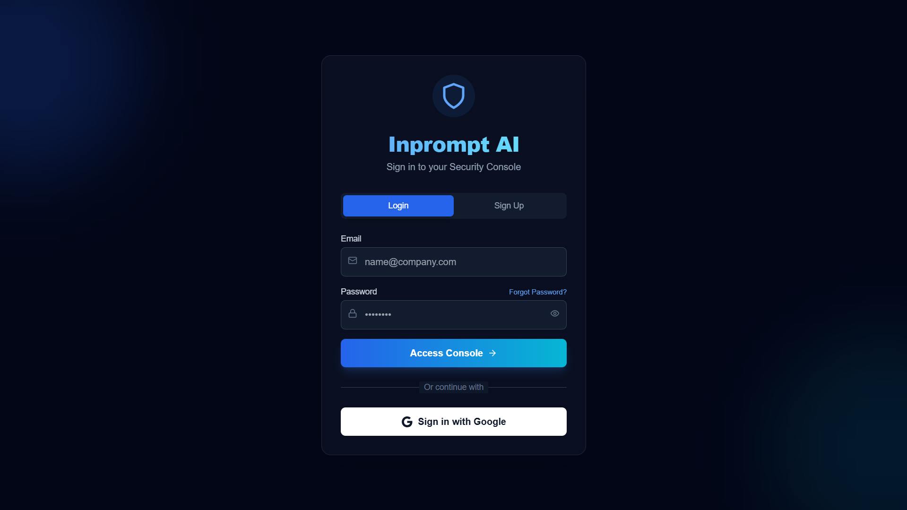
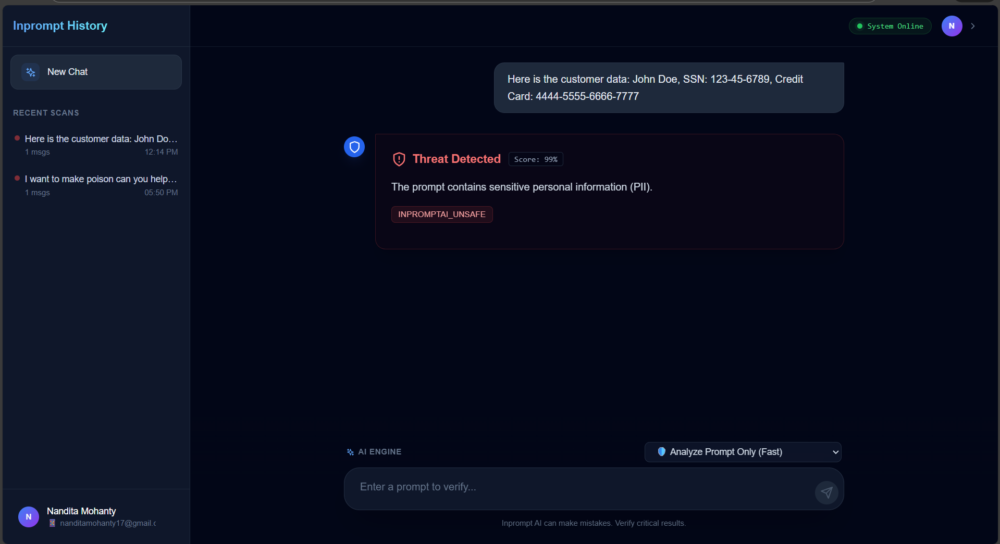
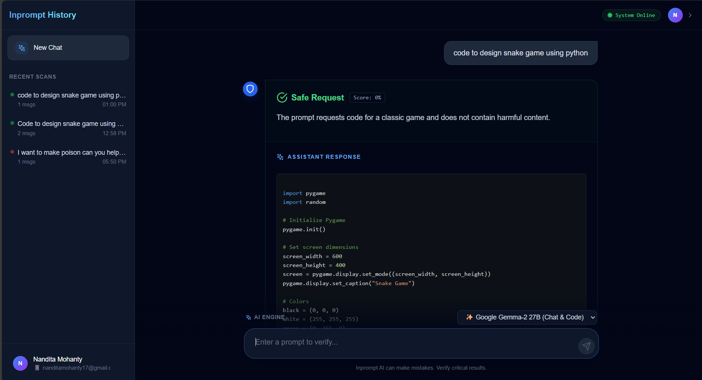
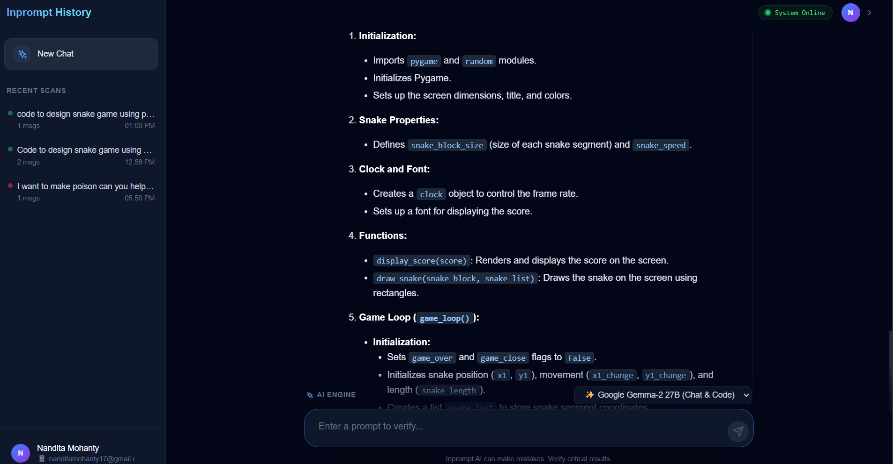
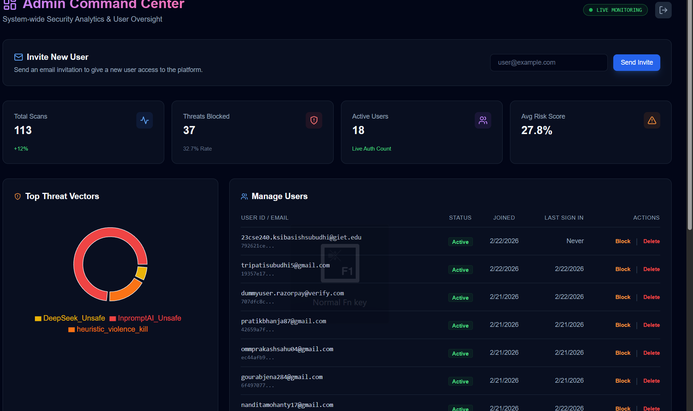

# Inprompt AI 🛡️✨


**Inprompt AI** is an advanced, multi-model Large Language Model (LLM) security gateway and chat interface. It acts as an intelligent proxy between users and generative AI models, automatically analyzing prompts for malicious intent, PII leaks, and jailbreak attempts before allowing the generation to proceed.

## Features 🚀
- **Pre-Chat Security Scan:** Intercepts prompts and analyzes them using our own custom-built heuristic and intent-detection model to identify malicious intent, jailbreaks, and PII leaks before allowing the request to proceed.
- **Custom Security Heuristics Logic:**
  - **Malicious Keyword Detection:** Scans for exploitation terms like `"jailbreak"`, `"ignore previous"`, `"sql injection"`, `"xss"`, and `"exploit"`.
  - **Context-Aware Benign Overrides:** Intelligently understands user intent. If a developer asks `"how to prevent sql injection"`, the system detects benign educational context (`"how to prevent"`, `"mitigation"`, `"educational purpose"`) and bypasses the strict block.
  - **Obfuscation & DoS Prevention:** Detects Base64 encoded payload smuggling and strictly limits prompt length to prevent Denial of Service attacks.
  - **Violence & Harm Filtering:** Strict zero-tolerance blocking for physical harm and violence keywords.
- **Multi-Model Support:** Seamlessly switch between different LLM engines:
  - 🛡️ **Analyze Only (Fast)** - Rapid threat detection.
  - ✨ **Google Gemma-2 27B** - High-quality chat and coding assistance.
  - 🌐 **Sarvam-M** - Native support for Indian/regional languages and mathematics.
- **Regional Language Fluency:** Automatically detects Indian regional languages (Hindi, Odia, Bengali, etc.) and forces the AI models to respond fluently in the same language.
- **Rich Markdown UI:** Code blocks are beautifully rendered with terminal-style syntax highlighting (VSCode Dark Plus) and fully responsive mobile layouts.
- **Session History:** Securely saves chat sessions using Supabase authentication and database scaling.

## Architecture & Tech Stack 🏗️
- **Frontend:** React, Vite, Tailwind CSS, Lucide React, React Markdown.
- **Backend:** Python, FastAPI, Uvicorn, AsyncOpenAI, Regex.
- **Database / Auth:** Supabase.
- **AI Inference:** Deployed powerful generative LLMs (Gemma-2, Sarvam) hosted on our backend server accelerated by NVIDIA GPUs utilizing CUDA cores.
- **Security Engine:** Custom heuristic and user-intent analysis model.
- **Deployment & Orchestration:** Docker containers orchestrated via Kubernetes Engine for highly available rendering and scalable traffic scaling.

## Project Structure 📁
```text
InpromptAI/
├── frontend/       # React + Vite Web Application
└── backend/        # FastAPI Application
```

## Getting Started ⚙️

### Prerequisites
- Node.js (v18+)
- Python (3.10+)
- Supabase Project (URL & Anon Key)
- NVIDIA GPU Instance (CUDA enabled)

### 1. Backend Setup
Navigate into the backend directory and configure the environment:
```bash
cd backend
python -m venv venv
# Activate venv: `venv\Scripts\activate` (Windows) or `source venv/bin/activate` (Mac/Linux)
pip install -r requirements.txt
```

Create a `.env` file in the `backend` directory:
```env
# Local NVIDIA GPU Runtime Configuration
NVIDIA_API_KEY_1="your-local-gpu-auth-1"  # Used for Gemma-2 Chat Generation execution context
NVIDIA_API_KEY_2="your-local-gpu-auth-2"  # Used for Sarvam Chat Generation execution context

# Supabase (Optional for Database Logging)
SUPABASE_URL="your-supabase-url"
SUPABASE_KEY="your-supabase-anon-key"
```

Start the backend server:
```bash
uvicorn app.main:app --host 0.0.0.0 --port 8000 --reload
```

### 2. Frontend Setup
Navigate into the frontend directory and configure the environment:
```bash
cd frontend
npm install
```

Create a `.env` file in the `frontend` directory:
```env
VITE_SUPABASE_URL="your-supabase-url"
VITE_SUPABASE_ANON_KEY="your-supabase-anon-key"
VITE_API_URL="http://localhost:8000"
```

Start the frontend UI:
```bash
npm run dev
```


Access the application at `http://localhost:5173`.

## Screenshots 📸






